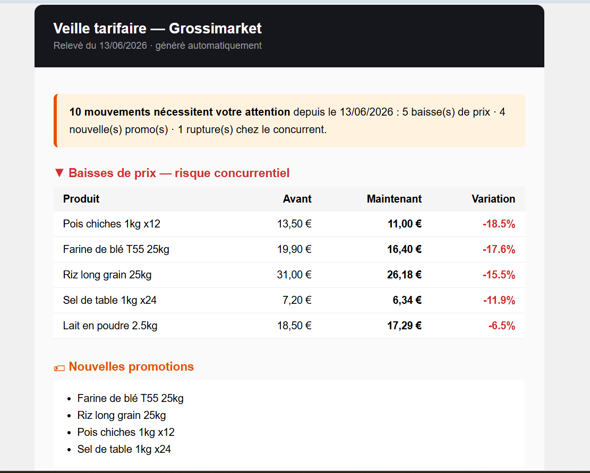
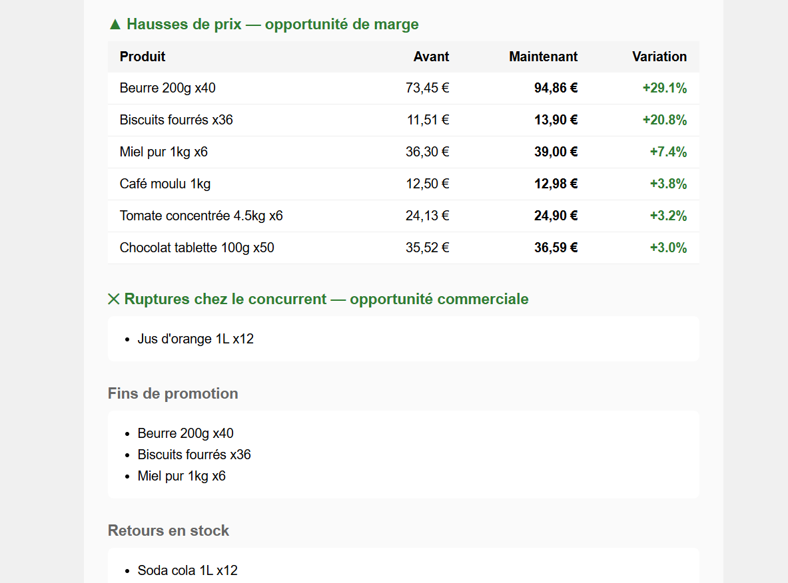

# VeillePrix — Veille tarifaire concurrentielle automatisée

> Savoir ce que font vos concurrents sans y passer 3 heures par semaine.
> Chaque lundi matin, un email vous signale les baisses de prix, nouvelles promotions
> et ruptures de stock chez vos concurrents — détectées automatiquement.



## Le problème

Une PME de distribution suit ses concurrents à la main : quelqu'un visite leurs sites,
note les prix dans un Excel, compare avec le relevé précédent. Résultat : 2 à 4 heures
par semaine, des oublis, et des réactions toujours en retard sur le marché.

## La solution

```
Site concurrent ──> Scraper ──> Comparateur ──> Rapport email
                    extraction    détection vs     synthèse + alertes
                    des prix      relevé précédent  rouge/orange/vert
                          │
                 GitHub Actions (cron lundi 06h00) — zéro serveur
```

Le système détecte automatiquement, d'une semaine sur l'autre :

| Événement | Lecture commerciale |
|---|---|
| ▼ Baisse de prix concurrent | Risque : alignement à étudier |
| 🏷 Nouvelle promotion | Risque : pression sur vos volumes |
| ▲ Hausse de prix concurrent | Opportunité de marge |
| ✕ Rupture de stock concurrent | Opportunité commerciale immédiate |
| Nouveaux produits / retraits | Évolution de l'offre concurrente |

## Démonstration

Le projet inclut un site concurrent fictif (« Grossimarket », 30 références alimentaires)
dont les prix évoluent à chaque relevé — ce qui permet de voir la détection en action
sans scraper de site réel. **En mission client, le scraper est adapté au(x) site(s)
concurrent(s) réel(s) du client** (la structure du code reste identique : seuls les
sélecteurs CSS changent).

```bash
pip install -r requirements.txt

python generate_site.py --releve 1     # site concurrent, semaine 1
python main.py                          # 1er relevé (initialise l'historique)

python generate_site.py --releve 2     # les prix ont bougé
python main.py                          # détection + rapport dans rapports/
```

Sortie console :

```
=== VeillePrix — relevé du 12/06/2026 ===
1. Scraping : 30 produits extraits (4 promos, 1 ruptures)
2. Comparaison vs 05/06/2026 : 27 événements (9 baisses, 8 hausses, 2 promos, 1 ruptures)
3. Historique mis à jour
4. Rapport généré : rapports/veille_2026-06-12.html
```

## Automatisation

Le workflow GitHub Actions (`.github/workflows/veille.yml`) :
- tourne chaque lundi à 06h00, sans serveur
- envoie le rapport par email si les secrets SMTP sont configurés
  (`SMTP_HOST`, `SMTP_PORT`, `SMTP_USER`, `SMTP_PASS`, `RAPPORT_DESTINATAIRE`)
- commite l'historique des relevés dans le repo (traçabilité complète)
- publie chaque rapport en artifact (90 jours de rétention)

## Éthique du scraping

En mission réelle : respect du `robots.txt`, fréquence raisonnable (1 relevé/semaine),
identification claire dans le User-Agent, et uniquement des données publiques
(prix affichés). Pas de contournement de protections.

## Stack

Python · requests · BeautifulSoup · pandas · GitHub Actions

---

**Tassembedo Ulrich David** — Data Science & IA · [GitHub](https://github.com/Davlamelo)
